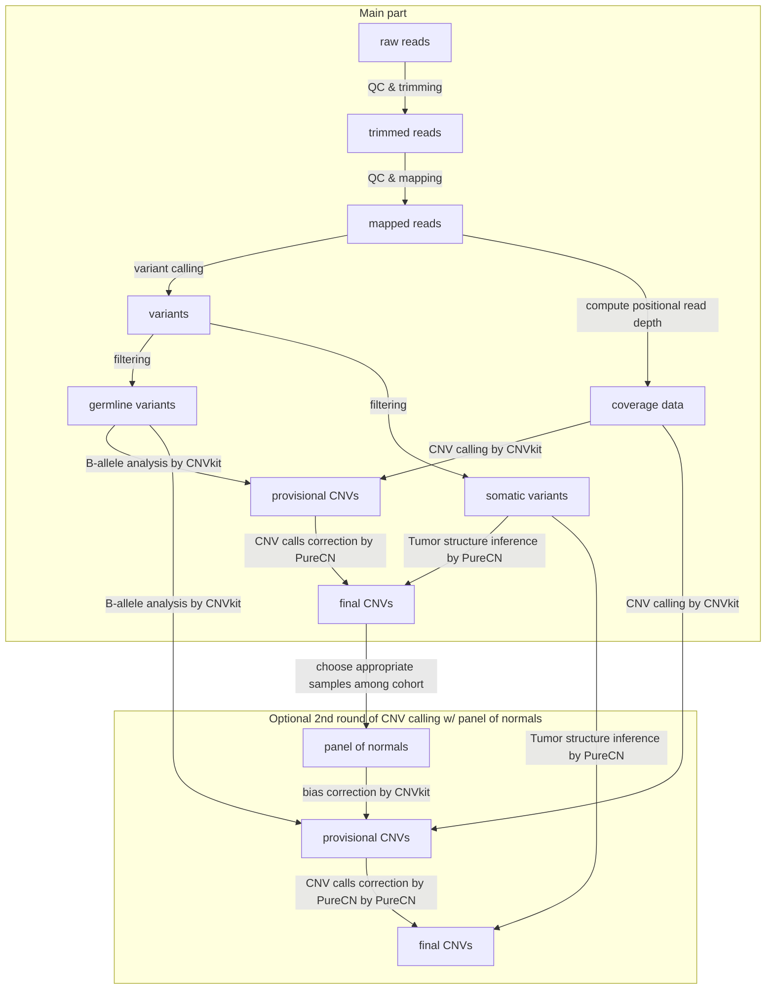

# cnakepit 🐍

## Definition

> A snake pit is, in a literal sense, a hole filled with snakes. In idiomatic speech, "snake pits" are places of horror, torture and death in European legends and fairy tales. [(Wikipedia)](https://en.wikipedia.org/wiki/Snake_pit)

In the field of bioinformatics, a cnakepit is now a **C**opy **N**umber **A**lterations detection sna**KE**make **PI**peline for tumor-only **T**argeted sequencing data. In the truest sense of the word, this horrific pit is filled with snakes such as [python](https://www.python.org/)s, [mamba](https://github.com/mamba-org/mamba)s and ana[conda](https://docs.conda.io/en)s.

## What is it?

This is a pipeline to (attempt to) call CNAs / CNVs by addressing the following challenges:
- requires **no matched** normal sample
- *ideally, requires no reference sample or panel of normals*
- suited for **short reads** *(Illumina)*
- detects (and filters for) **somatic** CNVs
- suitable for **panels** (/targeted sequencing)
- maintained
- publicly used *(>50 citations if not too new)*
- *ideally infers tumor structure and estimates tumor characteristics such as tumor ploidy & purity*

This pipeline was originally forked (and later *unforked*) from [this private repo named FFPE-panel-pipeline](https://github.com/Pregelnuss/FFPE-panel-pipeline) which pre-processes raw reads and later maps them.

## Installation

1. [Install conda](https://conda.io/projects/conda/en/latest/user-guide/install/index.html) (usually already installed on clusters)
2. [Install a conda environment with SnakeMake](https://snakemake.readthedocs.io/en/stable/getting_started/installation.html): ``conda create -c conda-forge -c bioconda -n snakemake-vanilla snakemake=7.32.3``  
   Note that I specified an older version of SnakeMake because, as of January '24, the newest version is incompatible with the current SnakeMake profile of the CUBI cluster and our pipeline_job.sh.  
All other required tools and dependencies will be installed automatically by SnakeMake during the first run of the pipeline.

## Usage

1. Set your configuration in the config/config.yaml file. Most options are documented or self-explanatory.
2. In the resources directory, add your panel design BED file and your samples (sheet) to the data subdirectory.
3. Activate your conda environment with SnakeMake installed: ``conda activate snakemake-vanilla``.
4. Before actually running the pipeline, test your configuration with a [dry run](https://snakemake.readthedocs.io/en/stable/executing/cli.html#useful-command-line-arguments) by adding ``-n`` to the SnakeMake command.
The pipeline can be run either by submitting the job script with ``sbatch pipeline_job.sh`` to [SLURM](https://slurm.schedmd.com/quickstart.html) or by calling SnakeMake directly with a command like ``snakemake --use-conda or snakemake --use-conda -c 8`` (preferably on a compute node).

## General workflow

- Read preprocessing: QC of the raw data, trimming, QC of the trimmed data
- Mapping and QC
- Variant detection and filtering with [Mutect2](https://www.biorxiv.org/content/10.1101/861054v1.full.pdf) / [GATK](https://gatk.broadinstitute.org/hc/en-us)
- CNV calling by [CNVkit](https://doi.org/10.1371/journal.pcbi.1004873) with different segmentation methods
- Tumor analysis and CNV correction by [PureCN](https://doi.org/10.1186/s13029-016-0060-z):
    - either hierarchical clustering of CNVs or
    - minimal re-segmentation with [PSCBS](https://doi.org/10.1093%2Fbioinformatics%2Fbtr329)
- For testing purposes, there is now an option to include a premade panel of normals file (RDS format) for PureCN, which will skip the coverage computation and segmentation by CNVkit and consequently any additional round of CNV calling with any other panel of normals.

